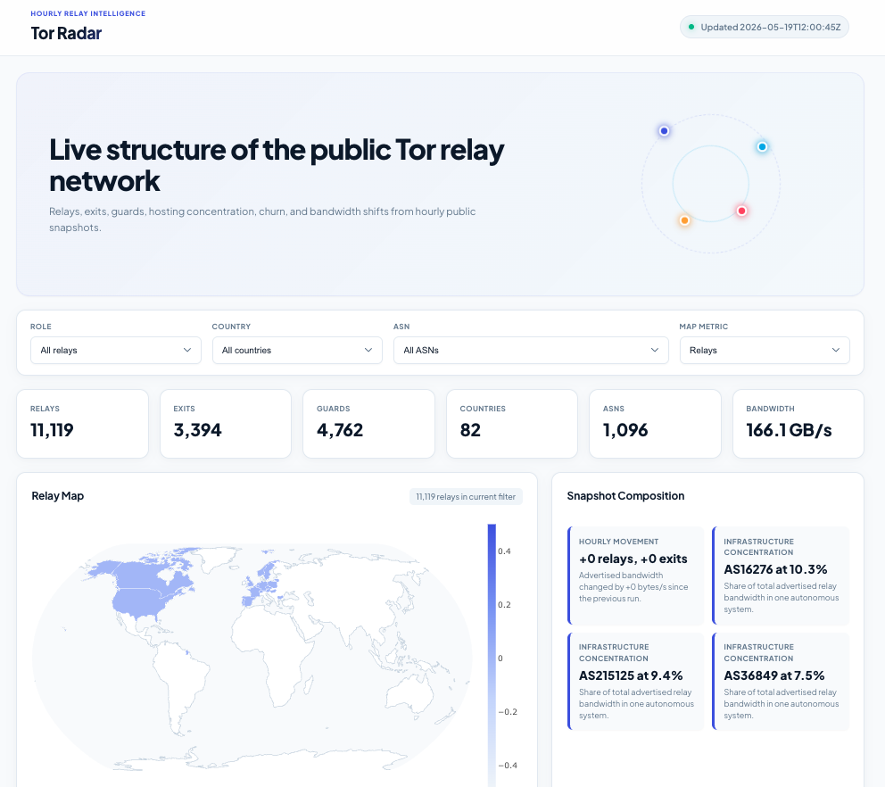

# Tor Radar

<p align="center">
  
</p>

<p align="center">
  <a href="LICENSE">
    
  </a>
  <a href="https://github.com/ipanalytics/Tor-Radar/actions">
    
  </a>
  <a href="https://ipanalytics.github.io/Tor-Radar/">
    
  </a>
  <a href="https://github.com/ipanalytics/Tor-Radar">
    
  </a>
  <a href="https://github.com/ipanalytics/Tor-Radar">
    
  </a>
  <a href="https://github.com/ipanalytics/Tor-Radar">
    
  </a>
</p>

---

Tor Radar is a static Tor relay intelligence dashboard and dataset built entirely on GitHub Pages infrastructure.

The project collects public Tor relay metadata, stores compact historical snapshots, and publishes an interactive browser-based dashboard without requiring a backend, database, or external runtime services.

---

## Live Dashboard

### [https://ipanalytics.github.io/Tor-Radar/](https://ipanalytics.github.io/Tor-Radar/)

<p align="center">
  
</p>

Repository:

```text id="h2r0uy"
https://github.com/ipanalytics/Tor-Radar
```

---

## Overview

Tor Radar tracks public Tor relay infrastructure over time and publishes normalized snapshots suitable for operational visibility, analytics, enrichment pipelines, and longitudinal network analysis.

The project focuses on:

* relay inventory visibility
* network churn tracking
* ASN concentration analysis
* country distribution
* relay role classification
* historical trend retention

All outputs are static artifacts generated through scheduled GitHub Actions workflows.

---

## Architecture

```text id="uj6j9d"
             Public Tor Sources
                      │
        ┌─────────────┴─────────────┐
        │                           │
        ▼                           ▼
   Tor Relay List             Onionoo Metadata
        │                           │
        └─────────────┬─────────────┘
                      ▼
               Enrichment Layer
           relay roles / ASN / geo
                      ▼
              Snapshot Generator
         current + historical outputs
                      ▼
               Static Dashboard
            GitHub Pages deployment
```

---

## Data Sources

| Source                                   | Purpose                       |
| ---------------------------------------- | ----------------------------- |
| `https://www.dan.me.uk/torlist/?full`    | Public Tor relay IP inventory |
| `https://onionoo.torproject.org/details` | Official Tor relay metadata   |

The collector merges relay inventory with Onionoo metadata to produce enriched network snapshots.

---

## Published Outputs

| File                         | Description                            |
| ---------------------------- | -------------------------------------- |
| `data/current/network.json`  | Latest enriched relay network snapshot |
| `data/snapshots/*.json`      | Hourly retained snapshots              |
| `data/history/summary.csv`   | Compact historical metrics             |
| `data/history/summary.jsonl` | Machine-readable historical timeline   |
| `public/`                    | Static dashboard assets                |
| `public/assets/`             | Dashboard JavaScript and CSS           |

---

## Dashboard Features

| Feature            | Description                         |
| ------------------ | ----------------------------------- |
| Relay distribution | Country and ASN concentration views |
| Historical trends  | Relay count and churn tracking      |
| Role visibility    | Exit, guard, middle relay breakdown |
| Snapshot history   | Historical network comparisons      |
| Static deployment  | No backend or runtime dependencies  |
| Compact retention  | Git-native historical storage       |

---

## Local Update

### Refresh datasets

```bash id="4v0mgd"
python3 scripts/update.py
```

### Build local preview

```bash id="0i0q0r"
rm -rf site

cp -R public site
cp -R data site/data

python3 -m http.server 8080 --directory site
```

Open:

```text id="r9r8sd"
http://127.0.0.1:8080/
```

---

## GitHub Pages Deployment

The GitHub Actions workflow updates datasets hourly and deploys the generated dashboard directly to GitHub Pages.

Workflow:

```text id="r3n8rb"
.github/workflows/tor-radar.yml
```

Deployment behavior:

* `public/` becomes the Pages root
* `data/` is deployed alongside dashboard assets
* the UI fetches `data/current/network.json` directly from Pages storage

Required repository settings:

* Enable GitHub Pages
* Set Pages source to `GitHub Actions`
* Allow Actions read/write repository permissions

---

## Retention Policy

Default retention configuration:

| Dataset         | Retention                 |
| --------------- | ------------------------- |
| Snapshot files  | Last 168 hourly snapshots |
| Summary history | Last 720 rows             |

Workflow overrides:

| Variable                       | Description                     |
| ------------------------------ | ------------------------------- |
| `TOR_RADAR_SNAPSHOT_RETENTION` | Snapshot retention count        |
| `TOR_RADAR_HISTORY_RETENTION`  | Summary history retention       |
| `TOR_RADAR_DAN_REFRESH_HOURS`  | Upstream relay refresh interval |
| `TOR_RADAR_USER_AGENT`         | Collector user-agent            |

---

## Operational Notes

* Relay inventories are derived from public upstream disclosures
* Relay concentration alone should not be treated as attribution
* Infrastructure overlap between providers is expected
* Historical churn and relay metadata are intended as analytical signals
* The project intentionally avoids active probing or relay interaction

---

## Use Cases

| Domain              | Example                                  |
| ------------------- | ---------------------------------------- |
| SIEM Enrichment     | Tor relay attribution                    |
| Fraud Detection     | Exit node visibility                     |
| Threat Hunting      | Historical relay analysis                |
| Network Analytics   | ASN and country concentration            |
| Security Operations | Relay trend monitoring                   |
| Research            | Longitudinal Tor infrastructure analysis |

---

## Repository Layout

```text id="cfh7m9"
Tor-Radar/
├── .github/
│   └── workflows/
├── data/
│   ├── current/
│   ├── history/
│   └── snapshots/
├── docs/
├── public/
│   └── assets/
├── scripts/
├── LICENSE
└── README.md
```

---

## Design Goals

* Fully static deployment
* Git-native historical storage
* No external database dependency
* Low operational overhead
* Reproducible snapshot generation
* Browser-only dashboard rendering

---

## Roadmap

Planned additions:

* ASN trend diffing
* Relay churn analytics
* Historical topology comparisons
* Prefix aggregation summaries
* Compact compressed archives
* Export filtering improvements

---

## License

Licensed under CC0-1.0.

See [`LICENSE`](./LICENSE).

---

## Disclaimer

Tor Radar publishes observational infrastructure metadata derived from public sources for analytical and operational use. Consumers are responsible for validating suitability within their own environments.
